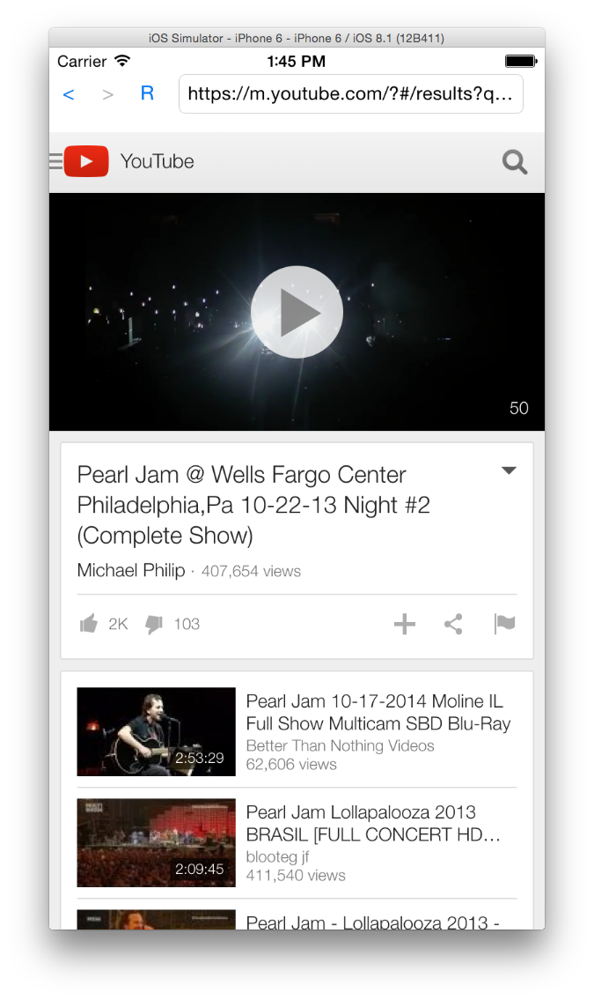

# browser-demo-ios
Demo of a simple web browser based on UIWebView.  This is the Objective-C version.  Swift version is [here](https://github.com/bryanwagner/browser-demo-ios-swift).

Screen Shot 1                 | Screen Shot 2
:----------------------------:|:-------------------------------:
          |  
